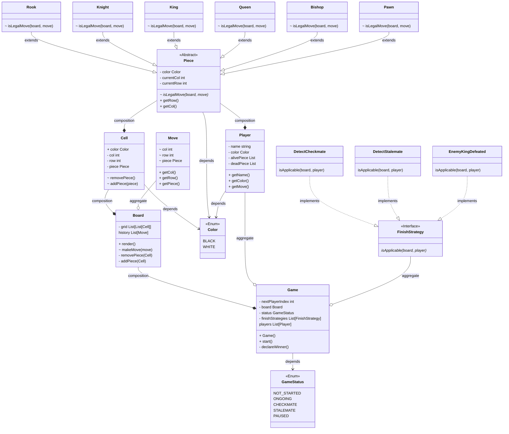

## Requirements

- Create a representation for the chessboard.
- Represent all the pieces: King, Queen, Bishop, Knight, Rook, and Pawn.
- Differentiate the pieces based on color: Black and White.
- Each piece should have a method to determine its legal moves based on its current position.
- The chessboard should have a method to move a piece from one position to another.
- There should be a way to check the status of the game, e.g., ongoing, check, checkmate, or stalemate.
- The game should support special moves: castling, pawn promotion, and en passant.
- Implement a player class, where each player has a color and a set of pieces.
- Include a game class that will handle turn-based gameplay between two players.
- The game should have a method to capture and remove a piece from the board.

        

    

