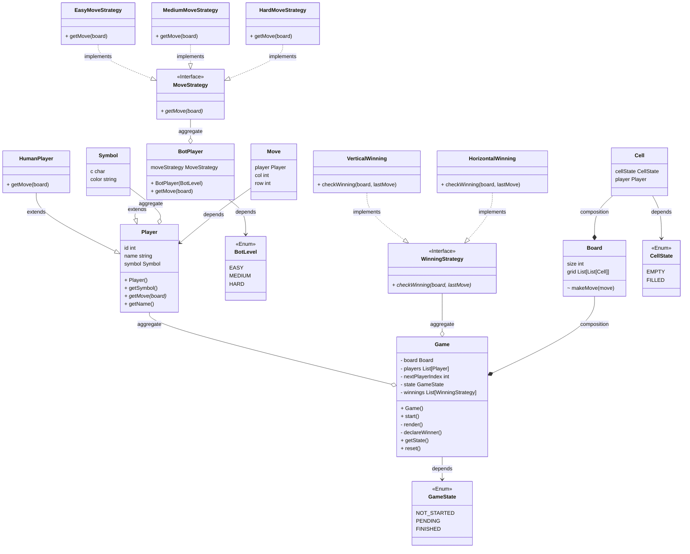

# Requirements

- There should be two players in the game: 'X' and 'O'.
- The board should have 3x3 cells.
- Players take alternate turns to place their marks on the board.
- A player can place their mark only on an unoccupied cell.
- The game should be able to identify and announce the winner (if there is one) or if the game is a draw.
- The game should be able to display the current state of the board.
- The game should have the ability to reset the board for a new game.
- There should be methods to validate the move.
- The game should maintain the history of moves.
- Players should be able to query the game's rules.

